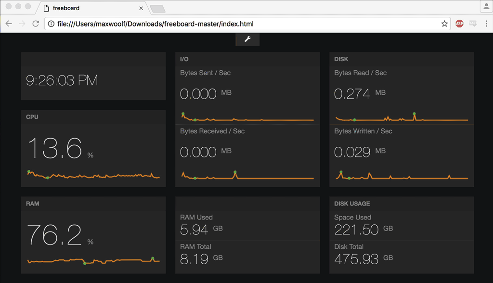
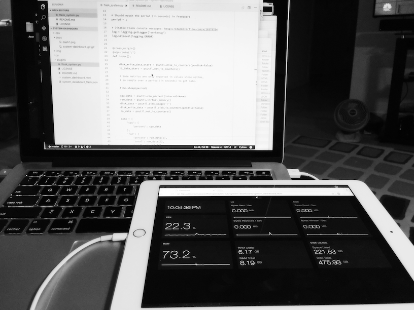

# Cross-Platform System Dashboard



This repository is a Minimalist Win/OSX/Linux System Dashboard for Python 2/3 using [Flask](http://flask.pocoo.org) and [Freeboard](https://github.com/Freeboard/freeboard). This tool was created extremely quickly (less than a couple hours) as a "Hello World" test for both technologies, with impressive and practical results for the amount of time invested.

The cross-platform system information is derived from the `psutil` Python package, which is exposed by a minimal Flask API and retrieved by Freeboard. This data includes:

* CPU %
* RAM %
* Disk Read/Write
* Bytes Sent/Received
* RAM Used/Total
* Disk Used/Total

This dashboard is especially useful if placed on a secondary screen, such as another monitor, or a connected iPad running the [Duet](http://www.duetdisplay.com) app.



## Setup

To install the Python dependencies, run:

```
pip install psutil flask flask_cors
```

Download/Clone this repository, then open a Terminal/Command Prompt and `cd` into the folder containing the files. To start the Flask server, run:

```
python flask_system.py
```

After the server starts running, open up a Freeboard window by opening `system_dashboard.html` in any browser (Chrome recommended), choose Load Freeboard, and select the `system_daskboard_flask.json` config file. Done!

## Maintainer

Max Woolf ([@minimaxir](http://minimaxir.com))

## Credits

[Flask JSONDash](https://github.com/christabor/flask_jsondash) by Chris Tabor which gave me the silly idea to work on a local dashboard, and noted the CORS requirement for Flask.

## License

MIT

The included Freeboard code is redistributed per its MIT License.