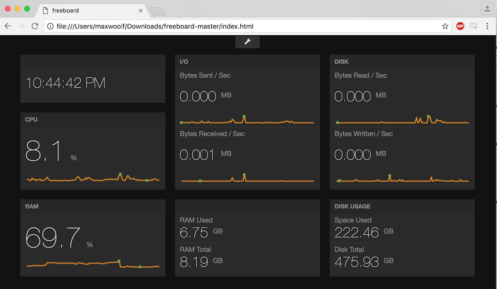

# system-dashboard



Minimalist Win/OSX/Linux System Dashboard using Flask and Freeboard. This tool was created extremely quickly (less than a couple hours) as a "Hello World" test for both technologies, with impressive and practical results for the amount of time invested.

The cross-platform system information is derived from the `psutil` Python package.

## Setup

To install the Python dependencies, run:

```
pip install psutil flask flask_cors
```

Then run the Flask server by `cd` into the folder containing the files, then run:

```
python flask_system.py
```

After the server starts running, open up a Freeboard window, and load the `system_daskboard_flask.json` config file. Done!